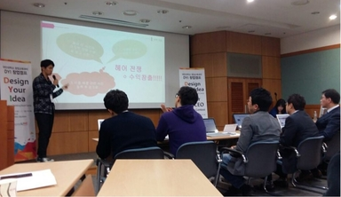

# Project

# Important Project Issue

There are some problem to convert sdk-linux-am57xx-evm-04.03.00.05 to 05.00.00.15.

## Contribution Summary

- [Master](#master)
  - [Sanghoon Lee](#sanghoon-lee)
- [Member](#member)
  - [Hyunwoo Park](#hyunwoo-park)
  - [Sangjae Ahn](#sangjae-ahn)

## Master
### Sanghoon Lee
### E-mail Address - gcccompil3r@gmail.com

|Subject|Title|Link|
|-|-|-|
|Power Electronics|LC Resonance|[pdf](https://github.com/SHL-Third-Education/Project/blob/master/experiment/doc/circuit/book_study/LC%20Resonance.pdf)|
|Power Electronics|SMPS Power Electronics 1|[pdf](https://github.com/SHL-Third-Education/Project/blob/master/experiment/doc/circuit/book_study/SMPS_PowerElectronics_1.pdf)|
|Power Electronics|SMPS Power Electronics 5|[pdf](https://github.com/SHL-Third-Education/Project/blob/master/experiment/doc/circuit/book_study/SMPS_PowerElectronics_5.pdf)|
|Week Mission|1st Week Mission|[pdf](https://github.com/SHL-Third-Education/Project/blob/master/cur_present/%EC%B4%9D%EA%B4%84%EC%84%A4%EA%B3%84%EC%A0%90%EA%B2%80/Project_1.pdf)|
|Week Mission|2nd Week Mission|[pdf](https://github.com/SHL-Third-Education/Project/blob/master/cur_present/%EC%B4%9D%EA%B4%84%EC%84%A4%EA%B3%84%EC%A0%90%EA%B2%80/Project_2.pdf)|
|Week Mission|3rd Week Mission|[pdf](https://github.com/SHL-Third-Education/Project/blob/master/cur_present/%EC%B4%9D%EA%B4%84%EC%84%A4%EA%B3%84%EC%A0%90%EA%B2%80/Project_3.pdf)|
|Week Mission|4th Week Mission|[pdf](https://github.com/SHL-Third-Education/Project/blob/master/cur_present/%EC%B4%9D%EA%B4%84%EC%84%A4%EA%B3%84%EC%A0%90%EA%B2%80/Project_4.pdf)|
|Week Mission|5th Week Mission|[pdf](https://github.com/SHL-Third-Education/Project/blob/master/cur_present/%EC%B4%9D%EA%B4%84%EC%84%A4%EA%B3%84%EC%A0%90%EA%B2%80/Project_5.pdf)|
|Week Mission|6th Week Mission|[pdf](https://github.com/SHL-Third-Education/Project/blob/master/cur_present/%EC%B4%9D%EA%B4%84%EC%84%A4%EA%B3%84%EC%A0%90%EA%B2%80/Project_6.pdf)|
|Week Mission|7th Week Mission|[pdf](https://github.com/SHL-Third-Education/Project/blob/master/cur_present/%EC%B4%9D%EA%B4%84%EC%84%A4%EA%B3%84%EC%A0%90%EA%B2%80/Project_7.pdf)|
|Week Mission|8th Week Mission|[pdf](https://github.com/SHL-Third-Education/Project/blob/master/cur_present/%EC%B4%9D%EA%B4%84%EC%84%A4%EA%B3%84%EC%A0%90%EA%B2%80/Project_8.pdf)|
|Week Mission|9th Week Mission|[pdf](https://github.com/SHL-Third-Education/Project/blob/master/cur_present/%EC%B4%9D%EA%B4%84%EC%84%A4%EA%B3%84%EC%A0%90%EA%B2%80/Project_9.pdf)|
|Week Mission|10th Week Mission|[pdf](https://github.com/SHL-Third-Education/Project/blob/master/cur_present/%EC%B4%9D%EA%B4%84%EC%84%A4%EA%B3%84%EC%A0%90%EA%B2%80/Project_10.pdf)|
|Week Mission|11th Week Mission|[pdf](https://github.com/SHL-Third-Education/Project/blob/master/cur_present/%EC%B4%9D%EA%B4%84%EC%84%A4%EA%B3%84%EC%A0%90%EA%B2%80/Project_11.pdf)|
|Week Mission|12th Week Mission|[pdf](https://github.com/SHL-Third-Education/Project/blob/master/cur_present/%EC%B4%9D%EA%B4%84%EC%84%A4%EA%B3%84%EC%A0%90%EA%B2%80/Project_12.pdf)|
|Design|Full Architecture|[pdf](https://github.com/SHL-Third-Education/Project/blob/master/experiment/doc/design/Full_Architecture.pdf)|
|Design|Lidar Signal Processing Design|[pdf](https://github.com/SHL-Third-Education/Project/blob/master/experiment/doc/design/Lidar_Signal_Processing_Design.pdf)|
|DSP|AM5728 FTDI USB 2 CAN|[pdf](https://github.com/SHL-Third-Education/Project/blob/master/experiment/doc/AM5728/AM5728_FTDI_USB_2_CAN.pdf)|
|DSP|AM5728 Wi-Fi Lab|[pdf](https://github.com/SHL-Third-Education/Project/blob/master/experiment/doc/AM5728/AM5728_WiFi_Lab.pdf)|
|DSP|AM5728 DSP Central Server Test|[pdf](https://github.com/SHL-Third-Education/Project/blob/master/experiment/doc/AM5728/AM5728_DSP_Server.pdf)|
|DSP|AM5728 Custom Kernel Compilation(Old Version)|[pdf](https://github.com/SHL-Third-Education/Project/blob/master/experiment/doc/AM5728/AM5728_Kernel_Compile.pdf)|
|DSP|AM5728 Wi-Fi Config Automation|[pdf](https://github.com/SHL-Third-Education/Project/blob/master/experiment/doc/AM5728/AM5728_DSP_WiFi_Automatic.pdf)|
|Battery|Battery(16000mAh) TATTU Translation to Korean|[pdf](https://github.com/SHL-Third-Education/Project/blob/master/experiment/doc/TMS570/Battery(16000mAh)_TATTU.txt)|
|Battery|Battery Charger|[pdf](https://github.com/SHL-Third-Education/Project/blob/master/experiment/doc/TMS570/Battery_Charger.pdf)|
|MCU|Cortex-R5F Based GPIO Control|[pdf](https://github.com/SHL-Third-Education/Project/blob/master/experiment/doc/TMS570/GPIO_Basic.pdf)|
|MCU|Cortex-R5F Based UART Control|[pdf](https://github.com/SHL-Third-Education/Project/blob/master/experiment/doc/TMS570/UART_Basic.pdf)|
|MCU|Cortex-R5F Can Test|[pdf](https://github.com/SHL-Third-Education/Project/blob/master/experiment/doc/TMS570/CAN_Test.pdf)|
|MCU|Configuring CAN TMS570 Translation(Korean)|[pdf](https://github.com/SHL-Third-Education/Project/blob/master/experiment/doc/TMS570/Configuring%20CAN%20TMS570.txt)|
|MCU|Cortex-R5F I2C Howto|[pdf](https://github.com/SHL-Third-Education/Project/blob/master/experiment/doc/TMS570/Cortex_R5_I2C_Howto.pdf)|
|MCU|Cortex-R5F I2C MPU6050 Control|[pdf](https://github.com/SHL-Third-Education/Project/blob/master/experiment/doc/TMS570/I2C_MPU6050_Control.pdf)|
|MCU|Cortex-R5F HET PWM|[pdf](https://github.com/SHL-Third-Education/Project/blob/master/experiment/doc/TMS570/HET_PWM.pdf)|
|MCU|I2C Communication Basic|[pdf](https://github.com/SHL-Third-Education/Project/blob/master/experiment/doc/TMS570/I2C_Comm.pdf)|
|MCU|Cortex-R5F RTI GPIO OC Circuit Configuration|[pdf](https://github.com/SHL-Third-Education/Project/blob/master/experiment/doc/TMS570/RTI_GPIO_OC_Config.pdf)|
|FPGA|Pmod CAN Control with Zynq Zybo|[pdf](https://github.com/SHL-Third-Education/Project/blob/master/experiment/doc/Zybo/Pmod_CAN_Control_with_Zybo.pdf)|
|MCU|SPI Communication Basic|[pdf](https://github.com/SHL-Third-Education/Project/blob/master/experiment/doc/TMS570/SPI_Comm.pdf)|
|MCU|Cortex-R5F SPI Loopback|[pdf](https://github.com/SHL-Third-Education/Project/blob/master/experiment/doc/TMS570/SPI_Loopback.pdf)|
|MCU|Understanding Encoder|[pdf](https://github.com/SHL-Third-Education/Project/blob/master/experiment/doc/TMS570/Understanding_Encoder.pdf)|
|MCU|RTI PWM|[pdf](https://github.com/SHL-Third-Education/Project/blob/master/experiment/doc/TMS570/RTI_PWM.pdf)|
|MCU|etPWM External Led Control|[pdf](https://github.com/SHL-Third-Education/Project/blob/master/experiment/doc/TMS570/etPWM_EXT_LED.pdf)|
|Assembly|TMS570LC4357 Basic Assembly Project|[pdf](https://github.com/SHL-Third-Education/Project/blob/master/experiment/doc/TMS570/TMS570LC4357_Assembly_Basic.pdf)|
|MCU|Cortex-R5F Based BLDC Motor Manual Calibration I|[pdf](https://github.com/SHL-Third-Education/Project/blob/master/experiment/doc/legacy/motor_control/ESCCalibration.pdf)|
|MCU|Cortex-R5F Based BLDC Motor Manual Calibration II|[pdf](https://github.com/SHL-Third-Education/Project/blob/master/experiment/doc/legacy/motor_control/MCU%EC%97%90%EC%84%9C%20%EB%AA%A8%ED%84%B0%20Calibration%20%EC%84%A4%EC%A0%95.pdf)|
|Design|Mastering Kalman Filter|[pdf](https://github.com/SHL-Third-Education/Project/blob/master/experiment/doc/control_theory/Upgrade_Kalman.pdf)|
|Control Theory|Kalman Test|[link](https://github.com/SHL-Third-Education/Project/tree/master/experiment/control_theory)|
|FPGA|FPGA Zynq Zybo Based MPU6050 Control|[pdf](https://github.com/SHL-Third-Education/Project/blob/master/experiment/doc/Zybo/Zynq_Zybo_Based_MPU6050_Control.pdf)|
|Statistics|All of statistics Library|[link](https://github.com/SHL-Third-Education/Project/tree/master/experiment/statistics)|
|Character Set|Character Set Conversion|[link](https://github.com/SHL-Third-Education/Project/tree/master/experiment/char_set)|
|Control Theory|Control Theory Test|[link](https://github.com/SHL-Third-Education/Project/tree/master/experiment/control_theory)|
|DSP|AM5728 DSP Server Code|[link](https://github.com/SHL-Third-Education/Project/tree/master/dsp_proj)|
|FPGA|Zynq Zybo Device Driver User Code|[link](https://github.com/SHL-Third-Education/Project/tree/master/experiment/zynq)|
|Quadcopter|MissionPlanner on Linux|[pdf](https://github.com/SHL-Third-Education/Project/blob/master/experiment/doc/rbq/MissionPlanner_on_Linux.pdf)|
|Quadcopter|Radar Based Quadcopter RTF Kit Translation(Korean)|[pdf](https://github.com/SHL-Third-Education/Project/blob/master/experiment/doc/rbq/Radar_Based_Quadcopter_RTF_Kit.pdf)|
|Android|Android NDK Configuration|[pdf](https://github.com/SHL-Third-Education/Project/blob/master/experiment/doc/android/Android_NDK_Env_Set_update_Linux.pdf)|
|Algorithm|Binary Search|[link](https://github.com/SHL-Third-Education/Project/blob/master/experiment/algorithm/binary_search.c)|
|Algorithm|Insertion Sort|[link](https://github.com/SHL-Third-Education/Project/blob/master/experiment/algorithm/insertion_sort.c)|
|Algorithm|Insertion Sort Descending|[link](https://github.com/SHL-Third-Education/Project/blob/master/experiment/algorithm/insert_sort_descend.c)|
|Algorithm|Internal Element Sort|[link](https://github.com/SHL-Third-Education/Project/blob/master/experiment/algorithm/form_arr_sort.c)|
|Algorithm|Internal Element Descending Sort|[link](https://github.com/SHL-Third-Education/Project/blob/master/experiment/algorithm/form_arr_descend_sort.c)|
|Algorithm|Red Black Tree Based Min Array Extraction|[link](https://github.com/SHL-Third-Education/Project/blob/master/experiment/algorithm/rbt_arr_extract.c)|
|Algorithm|N-Order Polyfit Algorithm|[link](https://github.com/SHL-Third-Education/Project/blob/master/experiment/algorithm/polyfit.cpp)|
|Math|Linear Algebra|[link](https://github.com/SHL-Third-Education/Project/blob/master/experiment/algorithm/linear_algebra.c)|
|CCS|How to Install CCS on Windows|[pdf](https://github.com/SHL-Third-Education/Project/blob/master/experiment/doc/TMS570/How_to_Install_CCS_on_Windows.pdf)|
|Arduino|How to Install Arduino on Windows|[pdf](https://github.com/SHL-Third-Education/Project/blob/master/experiment/doc/arduino/How_to_Install_Arduino_on_Windows.pdf)|
|Design|TI AM5728 OpenCL Architecture|[pdf](https://github.com/SHL-Third-Education/Project/blob/master/experiment/doc/opencl/OpenCL_with_TI_AM5728.pdf)|
|Slack|How to create Slack Workspace|[pdf](https://github.com/SHL-Third-Education/Project/blob/master/experiment/doc/git/How_to_create_slack_workspace.pdf)|
|Trello|How to use Trello|[pdf](https://github.com/SHL-Third-Education/Project/blob/master/experiment/doc/git/How_to_use_trello.pdf)|
|Git|Git Lab|[pdf](https://github.com/SHL-Third-Education/Project/blob/master/experiment/doc/git/Git_Lab.pdf)|
|Git|How to Install Git on Windows|[pdf](https://github.com/SHL-Third-Education/Project/blob/master/experiment/doc/git/How_to_Install_Git_on_Windows.pdf)|
|Git and MCU|How to commit Project on GitHub with HET Example|[pdf](https://github.com/SHL-Third-Education/Project/blob/master/experiment/doc/TMS570/How_to_Commit_All_Proj_on_Github.pdf)|
|Git|How to update git repo normally|[pdf](https://github.com/SHL-Third-Education/Project/blob/master/experiment/doc/git/How_to_update_git_repo_normally.pdf)|
|Git|How to solve when conflict occurance(fast)|[pdf](https://github.com/SHL-Third-Education/Project/blob/master/experiment/doc/git/How_to_solve_when_conflict_occurance.pdf)|
|Git|How to update git repo normally|[pdf](https://github.com/SHL-Third-Education/Project/blob/master/experiment/doc/git/How_to_update_git_repo_normally.pdf)|
|Git|How to interconnect Github with Slack|[pdf](https://github.com/SHL-Third-Education/Project/blob/master/experiment/doc/git/How_to_interconnect_github_with_slack.pdf)|
|Git|How to interconnect Trello with Slack|[pdf](https://github.com/SHL-Third-Education/Project/blob/master/experiment/doc/git/How_to_interconnect_trello_with_slack.pdf)|
|DSP|How to Integrated Test I|[pdf](https://github.com/SHL-Third-Education/Project/blob/master/experiment/doc/AM5728/DSP_Integrated_Test_I.pdf)|
|DSP|DSP Wi-Fi Secure AP Configuration Script|[link](https://github.com/SHL-Third-Education/Project/tree/master/dsp_proj/wl18xx_config)|
|DSP|How to make Secure Wi-Fi AP on AM5728|[pdf](https://github.com/SHL-Third-Education/Project/blob/master/experiment/doc/AM5728/How_to_make_Secure_AP.pdf)|
|DSP|AM5728 Remote System Explorer Configuration|[pdf](https://github.com/SHL-Third-Education/Project/blob/master/experiment/doc/AM5728/AM5728_RSE_Configuration.pdf)|
|DSP|Wi-Fi Matrix App Config Script|[link](https://github.com/SHL-Third-Education/Project/tree/master/dsp_proj/project_submenu), [link](https://github.com/SHL-Third-Education/Project/tree/master/dsp_proj/project_wifi)|
|DSP|How to make AM5728 Matrix App(Wi-Fi)|[pdf](https://github.com/SHL-Third-Education/Project/blob/master/experiment/doc/AM5728/How_to_make_AM5728_Matrix_App(Wi-Fi).pdf)|
|DSP|TIDL Basics Translation|[pdf](https://github.com/SHL-Third-Education/Project/blob/master/experiment/doc/deep_learn/TIDL_Translation.pdf)|
|DSP|TIDL API User Guide Translation|[pdf](https://github.com/SHL-Third-Education/Project/blob/master/experiment/doc/deep_learn/TIDL_API_User_Guide_Translation.pdf)|
|DSP & FPGA|DSP & FPGA Socket Environment Setting|[pdf](https://github.com/SHL-Third-Education/Project/blob/master/experiment/doc/AM5728/DSPnFPGA_Socket_Communication.pdf)|
|Design|Server Design Documentation|[pdf](https://github.com/SHL-Third-Education/Project/blob/master/experiment/doc/design/Server_Design.pdf)|
|PCB|Interlocked with OrCAD & Altium Designer|[pdf](https://github.com/SHL-Third-Education/Project/blob/master/experiment/doc/pcb/Interlocked_with_OrCAD_n_Altium_Designer.pdf)|
|PCB|Altium Designer Basics I|[pdf](https://github.com/SHL-Third-Education/Project/blob/master/experiment/doc/pcb/Altium_Basics_I.pdf)|
|PCB|Altium Designer Basics II|[pdf](https://github.com/SHL-Third-Education/Project/blob/master/experiment/doc/pcb/Altium_Basics_II.pdf)|
|FPGA|How to commit FPGA PetaLinux|[pdf](https://github.com/SHL-Third-Education/Project/blob/master/experiment/doc/Zybo/How_to_commit_FPGA_Petalinux_Project.pdf)|
|PCB|High Voltage Gate Driver PCB I|[pdf](https://github.com/SHL-Third-Education/Project/blob/master/experiment/doc/pcb/High_Voltage_Board_PCB.pdf)|
|DSP|AM5728 OpenCV Test|[pdf](https://github.com/SHL-Third-Education/Project/blob/master/experiment/doc/AM5728/AM5728_OpenCV_Test.pdf)|
|DSP|VCP Based Can Server|[link](https://github.com/SHL-Third-Education/Project/blob/master/dsp_proj/vcp_can_serv.c)|
|DSP|Fifo Based Can Server|[link](https://github.com/SHL-Third-Education/Project/blob/master/dsp_proj/fifo_can_serv.c)|
|DSP|Fifo Based Can Server with FPGA Lan Server|[link](https://github.com/SHL-Third-Education/Project/blob/master/dsp_proj/fifo_can_serv_final.c)|
|DSP|AM5728 ALSA Sound Driver Configuration|[pdf](https://github.com/SHL-Third-Education/Project/blob/master/experiment/doc/AM5728/AM5728_ALSA_Driver_Setting.pdf)|
|DSP|ALSA Driver Utilization|[link](https://github.com/SHL-Third-Education/Project/blob/master/sys_prog/alsa_pcm.c)|
|DSP|ALSA Mixer|[link](https://github.com/SHL-Third-Education/Project/blob/master/sys_prog/alsa_mixer.c)|
|DSP|ALSA MP3 Player|[link](https://github.com/SHL-Third-Education/Project/blob/master/sys_prog/mp_play.c)|
|DSP|Sound Engineering|[pdf](https://github.com/SHL-Third-Education/Project/blob/master/experiment/doc/AM5728/AM5728_Sound_Engineering_1.pdf)|
|DSP|Audio Signal Processing 1|[pdf](https://github.com/SHL-Third-Education/Project/blob/master/experiment/doc/AM5728/Audio_Signal_Processing_1.pdf)|
|FPGA|How to Install Vivado 2017 on Linux|[pdf](https://github.com/SHL-Third-Education/Project/blob/master/experiment/doc/Zybo/How_to_Install_Vivado_2017_on_Linux.pdf)|
|FPGA|How to Install PetaLinux 2017 on Linux|[pdf](https://github.com/SHL-Third-Education/Project/blob/master/experiment/doc/Zybo/How_to_Install_PetaLinux_2017_on_Linux.pdf)|
|FPGA|Zybo Z7 Based MPU6050 Control|[pdf](https://github.com/SHL-Third-Education/Project/blob/master/experiment/doc/Zybo/Zybo_Z7_Based_MPU6050_Control.pdf)|
|FPGA|Vivado HLS Tutorial 1|[pdf](https://github.com/SHL-Third-Education/Project/blob/master/experiment/doc/HLS/Creating_Vivado_HLS_Project.pdf)|
|FPGA|Vivado HLS Tutorial 2|[pdf](https://github.com/SHL-Third-Education/Project/blob/master/experiment/doc/HLS/Improving_Performance.pdf)|
|FPGA|Vivado HLS Tutorial 3|[pdf](https://github.com/SHL-Third-Education/Project/blob/master/experiment/doc/HLS/Improving_Resource_Utilization.pdf)|
|FPGA|Vivado HLS Tutorial 4|[pdf](https://github.com/SHL-Third-Education/Project/blob/master/experiment/doc/HLS/How_to_make_IP_with_Vivado_HLS.pdf)|
|FPGA|How to Install ModelSim on Linux|[pdf](https://github.com/SHL-Third-Education/Project/blob/master/experiment/doc/ModelSim/How_to_Setting_Modelsim_on_Linux.pdf)|
|OpenCV|How to Install OpenCV on Linux|[pdf](https://github.com/SHL-Third-Education/Project/blob/master/experiment/doc/opencv/How_to_install_OCV_on_Linux.pdf)|
|OpenCV|Basic Image Representation|[pdf](https://github.com/SHL-Third-Education/Project/blob/master/experiment/doc/opencv/Basic_Image_Representation.pdf), [link](https://github.com/SHL-Third-Education/Project/blob/master/ocv_proj/first.cpp)|
|OpenCV|Color Filter|[pdf](https://github.com/SHL-Third-Education/Project/blob/master/experiment/doc/opencv/Color_Filter.pdf), [link](https://github.com/SHL-Third-Education/Project/blob/master/ocv_proj/second.cpp)|
|OpenCV|Fixed ROI|[pdf](https://github.com/SHL-Third-Education/Project/blob/master/experiment/doc/opencv/Fixed_ROI.pdf), [link](https://github.com/SHL-Third-Education/Project/blob/master/ocv_proj/third.cpp)|
|OpenCV|Custom ROI|[pdf](https://github.com/SHL-Third-Education/Project/blob/master/experiment/doc/opencv/Custom_ROI.pdf), [link](https://github.com/SHL-Third-Education/Project/blob/master/ocv_proj/fourth.cpp)|
|OpenCV|Gaussian Blur|[pdf](https://github.com/SHL-Third-Education/Project/blob/master/experiment/doc/opencv/Gaussian_Blur.pdf), [link](https://github.com/SHL-Third-Education/Project/blob/master/ocv_proj/fifth.cpp)|
|VMware|How to Install VMWare 15 on Linux|[pdf](https://github.com/SHL-Third-Education/Project/blob/master/experiment/doc/VMware/How_to_Install_VMWare_on_Linux.pdf)|
|VMware|How to Install VMWare 12 on Linux|[pdf](https://github.com/SHL-Third-Education/Project/blob/master/experiment/doc/VMware/How_to_Install_VMWare_12_on_Linux.pdf)|
|VMware|How to Install Windows 7 on Linux VMWare|[pdf](https://github.com/SHL-Third-Education/Project/blob/master/experiment/doc/VMware/How_to_Install_Windows_7_on_Linux_VMWare.pdf)|
|VMware|How to Co-Work with VMware Windows on Linux|[pdf](https://github.com/SHL-Third-Education/Project/blob/master/experiment/doc/VMware/How_to_CoWork_with_VMware_Windows_on_Linux.pdf)|
|GStreamer|GStreamer Basics|[pdf](https://github.com/SHL-Third-Education/Project/blob/master/experiment/doc/gstreamer/GStreamer_Basics.pdf)|
|QT5|QT5 Basic|[pdf](https://github.com/SHL-Third-Education/Project/blob/master/experiment/doc/Qt5/QT5_Basic.pdf), [link](https://github.com/SHL-Third-Education/Project/blob/master/qt_proj/qt_img_viewer.cpp)|
|QT5|Hello QT5|[pdf](https://github.com/SHL-Third-Education/Project/blob/master/experiment/doc/Qt5/AM5728_QT5_Lab_1_Hello_QT5.pdf)|
|QT5|Environment Seeting|[pdf](https://github.com/SHL-Third-Education/Project/blob/master/experiment/doc/Qt5/AM5728_QT5_Lab_2_Env_Set.pdf)|
|QT5|QT5 Basic Event|[pdf](https://github.com/SHL-Third-Education/Project/blob/master/experiment/doc/Qt5/AM5728_QT5_Lab_3_Basic_Event.pdf)|
|QT5|QT5 Exploration|[pdf](https://github.com/SHL-Third-Education/Project/blob/master/experiment/doc/Qt5/AM5728_QT5_Lab_4_Exploration.pdf)|
|QT5|QWT Install & Usage|[pdf](https://github.com/SHL-Third-Education/Project/blob/master/experiment/doc/Qt5/QWT_Install_and_Usage.pdf)|
|Matlab|How to create Simulink Model|[pdf](https://github.com/SHL-Third-Education/Project/blob/master/experiment/doc/matlab/How_to_create_Simulink_Model.pdf)|
|Matlab|How to design Second Order Model|[pdf](https://github.com/SHL-Third-Education/Project/blob/master/experiment/doc/matlab/How_to_design_second_order_model.pdf)|
|Matlab|How to make Subsystem Block|[pdf](https://github.com/SHL-Third-Education/Project/blob/master/experiment/doc/matlab/How_to_make_Subsystem_Block.pdf)|
|Matlab|Matlab Basics|[pdf](https://github.com/SHL-Third-Education/Project/blob/master/experiment/doc/matlab/Matlab_Basics.pdf)|
|Matlab|Simulink Control Basics|[pdf](https://github.com/SHL-Third-Education/Project/blob/master/experiment/doc/matlab/Simulink_Control_Basics.pdf)|
|Matlab|How to use NCO(Numeric Control Oscillator)|[pdf](https://github.com/SHL-Third-Education/Project/blob/master/experiment/doc/matlab/How_to_use_NCO.pdf)|
|Matlab|Conditional Executed Subsystem(Enabled)|[pdf](https://github.com/SHL-Third-Education/Project/blob/master/experiment/doc/matlab/Conditional_Executed_Subsystem\(Enabled\).pdf)|
|Matlab|Matlab to Simulink Data Transfer|[pdf](https://github.com/SHL-Third-Education/Project/blob/master/experiment/doc/matlab/Matlab_to_Simulink_Data_Transfer.pdf)|
|BeagleBone|Ready to Analysis Linux Device Driver|[pdf](https://github.com/SHL-Third-Education/Project/blob/master/experiment/doc/device_driver/Ready_to_Analysis_BeagleBone_Based_Device_Driver.pdf)|

## Member

### Hyunwoo Park
### E-mail Address - phw820@naver.com

|Subject|Title|Link|
|-|-|-|
|Power Electronics|Introduction Buck Converter|[pdf](https://github.com/SHL-Third-Education/Project/blob/master/experiment/doc/circuit/book_study/BUCK%20CONVERTER%20.pdf)|
|Power Electronics|PSIM PID Control|[pdf](https://github.com/SHL-Third-Education/Project/blob/master/experiment/doc/circuit/book_study/PSIM%20PID%EC%A0%9C%EC%96%B4.pdf)|
|Power Electronics|PSIM Control I|[pdf](https://github.com/SHL-Third-Education/Project/blob/master/experiment/doc/circuit/book_study/PSIM%20STUDY%201.pdf)|
|Power Electronics|PSIM Control II|[pdf](https://github.com/SHL-Third-Education/Project/blob/master/experiment/doc/circuit/book_study/PSIM%20STUDY%202.pdf)|
|Power Electronics|SMPS Power Electronics 3|[pdf](https://github.com/SHL-Third-Education/Project/blob/master/experiment/doc/circuit/book_study/SMPS-chapter3.pdf)|
|Power Electronics|Buck Converter 12V 1A|[pdf](https://github.com/SHL-Third-Education/Project/blob/master/experiment/doc/circuit/book_study/BUCK_CONVERTER_12V_1A_design.pdf)|
|Power Electronics|Buck Design Tool|[pdf](https://github.com/SHL-Third-Education/Project/blob/master/experiment/doc/circuit/book_study/buck%20design%20tool.xls)|
|MCU|Cortex-R5F Based ESC Calibration|[pdf](https://github.com/SHL-Third-Education/Project/blob/master/experiment/doc/TMS570/ESC%20Calibration.pdf)|
|MCU|Cortex-R5F Based MPU9250 Control|[zip](https://github.com/SHL-Third-Education/Project/blob/master/mcu_proj/__MPU9250.zip)|
|MCU|Cortex-R5F Based MPU9250 Control Doc|[pdf](https://github.com/SHL-Third-Education/Project/blob/master/experiment/doc/TMS570/_MPU9250.pdf)|
|MCU|Cortex-R5F Based MPU6050 with Integrated Kalman Filter Test|[pdf](https://github.com/SHL-Third-Education/Project/blob/master/experiment/doc/TMS570/MPU6050%2BSTM32.pdf)|
|MCU|Quadcopter|[link](https://github.com/SHL-Third-Education/Project/tree/master/mcu_proj/QuadCopter)|
|MCU|Quadcopter Non RTOS Test|[link](https://github.com/SHL-Third-Education/Project/tree/master/mcu_proj/pre_QuadCopter(none_RTOS))|
|MCU|Remote Controller Control|[pdf](https://github.com/SHL-Third-Education/Project/blob/master/experiment/doc/TMS570/RC_CONTROLLER.pdf)|
|MCU|Remote Controller Code|[link](https://github.com/SHL-Third-Education/Project/tree/master/mcu_proj/RC_controller_ecap)|
|MCU|BME280 Altitude Sensor Control|[pdf](https://github.com/SHL-Third-Education/Project/blob/master/experiment/doc/TMS570/_BMP280.pdf)|
|MCU|BME280 Altitude Sensor Code|[link](https://github.com/SHL-Third-Education/Project/tree/master/mcu_proj/I2C_BMP280)|
|MCU|MS5611 Control Doc|[pdf](https://github.com/SHL-Third-Education/Project/blob/master/experiment/doc/TMS570/MS5611.pdf)|
|MCU|MS5611 Control Code|[link](https://github.com/SHL-Third-Education/Project/tree/master/mcu_proj/I2C_MS5611)|
|FPGA|PWM & eCAP Verilog 2 VHDL|[pdf](https://github.com/SHL-Third-Education/Project/blob/master/experiment/doc/Zybo/FPGA_verilog_to_vhdl.pdf)|
|FreeRTOS|Dual PID Based QuadCopter|[link](https://github.com/SHL-Third-Education/Project/tree/master/mcu_proj/RTOS_QUADCOPTER)|
|Week Mission|1st Mission|[pdf](https://github.com/SHL-Third-Education/Project/blob/master/cur_present/%EC%95%84%EC%9D%B4%EC%96%B8%EB%93%9C%EB%A1%A0/%EB%B0%95%ED%98%84%EC%9A%B0/%EB%B0%95%ED%98%84%EC%9A%B0%20-%201%20%EC%A3%BC%EC%B0%A8%20%ED%94%84%EB%A1%9C%EC%A0%9D%ED%8A%B8%20%EC%A4%91%EA%B0%84%20%EB%B0%9C%ED%91%9C.pdf)|
|Week Mission|2nd Mission|[pdf](https://github.com/SHL-Third-Education/Project/blob/master/cur_present/%EC%95%84%EC%9D%B4%EC%96%B8%EB%93%9C%EB%A1%A0/%EB%B0%95%ED%98%84%EC%9A%B0/%EB%B0%95%ED%98%84%EC%9A%B0%20-%202%EC%A3%BC%EC%B0%A8%20%ED%94%84%EB%A1%9C%EC%A0%9D%ED%8A%B8%20%EC%A4%91%EA%B0%84%20%EB%B0%9C%ED%91%9C.pdf)|
|Week Mission|3rd Mission|[pdf](https://github.com/SHL-Third-Education/Project/blob/master/cur_present/%EC%95%84%EC%9D%B4%EC%96%B8%EB%93%9C%EB%A1%A0/%EB%B0%95%ED%98%84%EC%9A%B0/%EB%B0%95%ED%98%84%EC%9A%B0%20-%203%20%EC%A3%BC%EC%B0%A8%20%ED%94%84%EB%A1%9C%EC%A0%9D%ED%8A%B8%20%EC%A4%91%EA%B0%84%20%EB%B0%9C%ED%91%9C.pdf)|
|Week Mission|4th Mission|[pdf](https://github.com/SHL-Third-Education/Project/blob/master/cur_present/%EC%95%84%EC%9D%B4%EC%96%B8%EB%93%9C%EB%A1%A0/%EB%B0%95%ED%98%84%EC%9A%B0/%EB%B0%95%ED%98%84%EC%9A%B0%20-%204%20%EC%A3%BC%EC%B0%A8%20%ED%94%84%EB%A1%9C%EC%A0%9D%ED%8A%B8%20%EC%A4%91%EA%B0%84%20%EB%B0%9C%ED%91%9C.pdf)|
|Week Mission|5th Mission|[pdf](https://github.com/SHL-Third-Education/Project/blob/master/cur_present/%EC%95%84%EC%9D%B4%EC%96%B8%EB%93%9C%EB%A1%A0/%EB%B0%95%ED%98%84%EC%9A%B0/%EB%B0%95%ED%98%84%EC%9A%B0%20-%206%20%EC%A3%BC%EC%B0%A8%20%ED%94%84%EB%A1%9C%EC%A0%9D%ED%8A%B8%20%EC%A4%91%EA%B0%84%20%EB%B0%9C%ED%91%9C.pdf)|
|Week Mission|6th Mission|[pdf](https://github.com/SHL-Third-Education/Project/blob/master/cur_present/%EC%95%84%EC%9D%B4%EC%96%B8%EB%93%9C%EB%A1%A0/%EB%B0%95%ED%98%84%EC%9A%B0/%EB%B0%95%ED%98%84%EC%9A%B0%20-%207%20%EC%A3%BC%EC%B0%A8%20%ED%94%84%EB%A1%9C%EC%A0%9D%ED%8A%B8%20%EC%A4%91%EA%B0%84%20%EB%B0%9C%ED%91%9C.pdf)|
|BOM|Quadcopter BOM List|[pdf](https://github.com/SHL-Third-Education/Project/blob/master/cur_present/%EC%95%84%EC%9D%B4%EC%96%B8%EB%93%9C%EB%A1%A0/%EB%B0%95%ED%98%84%EC%9A%B0/%EB%93%9C%EB%A1%A0%20%EC%A0%9C%EC%9E%91%EC%97%90%20%ED%95%84%EC%9A%94%ED%95%9C%20%EB%B6%80%ED%92%88%EA%B3%BC%20%EA%B2%AC%EC%A0%81(%2B%EB%AA%A8%ED%84%B0%20%EC%B6%94%EB%A0%A5%2C%20%EB%B9%84%ED%96%89%EC%8B%9C%EA%B0%84%20%EA%B3%84%EC%82%B0).pdf)|
|Design|Non Inertia Frame|[pdf](https://github.com/SHL-Third-Education/Project/blob/master/experiment/doc/physics/none_inertia_frame.pdf)|

### Sangjae Ahn
### E-mail Address - sangjae2015@naver.com

|Subject|Title|Link|
|-|-|-|
|MCU|Cortex-R5F Based eQEP TRM Analysis|[pdf](https://github.com/KOITT2/RC_Car/blob/b474b0e4c22217db033a3d1bc65639d203444aa2/cur_present/%EB%9D%BC%EC%A0%A0%EC%B9%B4/%EC%95%88%EC%83%81%EC%9E%AC/eQEP_0725.pdf)|
|MCU|Cortex-R5F Based SPI Analysis & Loopback Test|[pdf](https://github.com/KOITT2/RC_Car/blob/9219044272f63e2aea244204703a762cc924a63b/cur_present/%EB%9D%BC%EC%A0%A0%EC%B9%B4/%EC%95%88%EC%83%81%EC%9E%AC/SPI%20%ED%86%B5%EC%8B%A0%20%EA%B0%9C%EB%85%90%20%EB%B0%8F%20Loopback%20%EA%B5%AC%ED%98%84.pdf)|
|MCU|Arduino Based ESP8266 Wi-Fi Module Firmware Upgrade|[pdf](https://github.com/KOITT2/RC_Car/blob/9f90c025ba363fa29cf6b206d5bd31125a4a26d3/test/test/1%EC%A3%BC%EC%B0%A8/wifi%20%EB%AA%A8%EB%93%88%20%ED%8E%8C%EC%9B%A8%EC%96%B4%20%EC%97%85%EA%B7%B8%EB%A0%88%EC%9D%B4%EB%93%9C.pdf)|
|MCU|SPI Communication(need to modify)|[pdf](https://github.com/KOITT2/RC_Car/blob/master/cur_present/%EB%9D%BC%EC%A0%A0%EC%B9%B4/%EC%95%88%EC%83%81%EC%9E%AC/SPI%20%EA%B5%AC%ED%98%84.pdf)|
|MCU|SPI Need to Modify|[pdf](https://github.com/KOITT2/RC_Car/blob/master/cur_present/%EB%9D%BC%EC%A0%A0%EC%B9%B4/%EC%95%88%EC%83%81%EC%9E%AC/SPI%20%EA%B5%AC%ED%98%84(MCU-MCU).pdf)|
|MCU|Collision Warn Sound Buzzer|[pdf](https://github.com/KOITT2/RC_Car/blob/master/experiment/doc/BUZZER.pdf)|
|MCU|Ultrasonic HC SR-04 Control|[pdf](https://github.com/KOITT2/RC_Car/blob/master/experiment/doc/Ultrasonic%20Ranging%20Module%20HC%20-%20SR04.pdf)|
|MCU|FM Radio with STM32F407|[pdf](https://github.com/KOITT2/RC_Car/blob/master/mcu_proj/FM%20Radio%20%EC%84%A4%EA%B3%84%20%EB%B3%B4%EA%B3%A0%EC%84%9C.pdf)|
|STM32F4|Getting Started STM32 with TrueStudio|[pdf](https://github.com/KOITT2/RC_Car/blob/master/experiment/doc/Getting%20Started%20STM32%20with%20True%20STUDIO%20%26%20CubeMx.pdf)|
|STM32F4|GPIO Control with STM32F407|[pdf](https://github.com/KOITT2/RC_Car/blob/master/experiment/doc/GPIO%20based%20on%20stm32.pdf)|
|STM32F4|UART Control with STM32F407|[pdf](https://github.com/KOITT2/RC_Car/blob/master/experiment/doc/UART%20based%20on%20stm32.pdf)|
|STM32F4|Timer Based PWM with STM32F407|[pdf](https://github.com/KOITT2/RC_Car/blob/master/experiment/doc/TIMER%20%26%20PWM%20control%20with%20STM32F407.pdf)|
|STM32F4|ADC & DAC Control with STM32F407|[pdf](https://github.com/KOITT2/RC_Car/blob/master/experiment/doc/ADC%20with%20DMA%20%26%20DAC.pdf)|
|STM32F4|I2C Control with STM32F407|[pdf](https://github.com/KOITT2/RC_Car/blob/master/experiment/doc/I2C%20Control%20with%20STM32F407.pdf)|
|STM32F4|MPU9250 Control with STM32F407|[pdf](https://github.com/KOITT2/RC_Car/blob/master/experiment/doc/Control%20MPU9250%20with%20I2C.pdf)|
|STM32F4|STM32F407 Based MPU9250 Control Code|[link](https://github.com/KOITT2/RC_Car/blob/master/experiment/doc/MPU9250_TEST.zip)|
|FreeRTOS|FreeRTOS on STM32F407|[pdf](https://github.com/KOITT2/RC_Car/blob/master/experiment/doc/FreeRTOS%20based%20on%20STM32F407.pdf)|
|FreeRTOS|All Summation MCU Code|[link](https://github.com/KOITT2/RC_Car/tree/master/mcu_proj/FreeRTOS)|
|Week Mission|1st Week Mission|[pdf](https://github.com/KOITT2/RC_Car/blob/master/cur_present/%EB%9D%BC%EC%A0%A0%EC%B9%B4/%ED%8C%80%EB%B0%9C%ED%91%9C/9%EC%A3%BC%EC%B0%A8%20%EB%9D%BC%EC%A0%A0%EC%B9%B4%20%EB%B0%9C%ED%91%9C.pdf)|
|PCB|Add Library on Altium|[pdf](https://github.com/KOITT2/RC_Car/blob/master/pcb/install%20Library%20based%20on%20Alitum.pdf)|
|PCB|Altium Based Circuit Simulation|[pdf](https://github.com/KOITT2/RC_Car/blob/master/pcb/Schematic%2C%20Simulation%2C%20PCB%20Design%20(Altium).pdf)|
|Week Mission|1st Mission|[pdf](https://github.com/KOITT2/RC_Car/blob/master/cur_present/%EB%9D%BC%EC%A0%A0%EC%B9%B4/%ED%8C%80%EB%B0%9C%ED%91%9C/10%EC%A3%BC%EC%B0%A8%20%EB%9D%BC%EC%A0%A0%EC%B9%B4%20%EB%B0%9C%ED%91%9C.pdf)|
|Circuit|Practical IR2110 Based Circuit|[pdf](https://github.com/KOITT2/RC_Car/blob/master/circuit/IR2110%20TEST.pdf)|
|Circuit|Practical IR2110 + TL494 Based Circuit|[pdf](https://github.com/KOITT2/RC_Car/blob/master/circuit/IR2110%2BTL494%20TEST.pdf)|
|Circuit|LM2576-ADJ Based DC-DC Converter|[pdf](https://github.com/KOITT2/RC_Car/blob/master/circuit/DCDC%20converter%20based%20on%20LM2576-adj.pdf)|
|Circuit|TL494 Based DC-DC Converter|[pdf](https://github.com/KOITT2/RC_Car/blob/master/circuit/DCDC%20converter%20based%20on%20TL494.pdf)|
|Circuit|TL494 + IR2110 Based DC-DC Converter|[pdf](https://github.com/KOITT2/RC_Car/blob/master/circuit/DC-DC%20CONVERTER%20TEST%20(IR2110%2BTL494).pdf)|
|Circuit|Astable Multivibrator Analysis|[pdf](https://github.com/KOITT2/RC_Car/blob/master/circuit/%EB%B9%84%EC%95%88%EC%A0%95%20%EB%A9%80%ED%8B%B0%EB%B0%94%EC%9D%B4%EB%B8%8C%EB%A0%88%EC%9D%B4%ED%84%B0%20%ED%9A%8C%EB%A1%9C%20%EB%B6%84%EC%84%9D.pdf)|
|Circuit|Fan Motor Control with Temperature Sensor|[pdf](https://github.com/KOITT2/RC_Car/blob/master/circuit/Control%20fan%20motor%20Circuit.pdf)|
